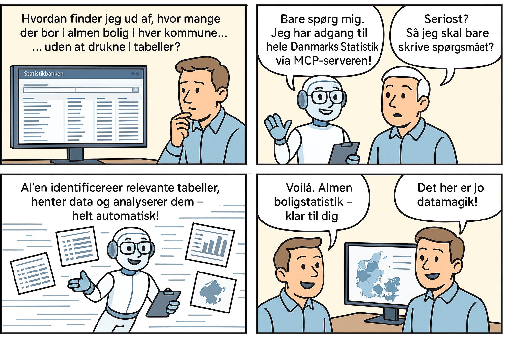

# MCP Server for Danmarks Statistik

En MCP (Machine Callable Programs) server, der eksponerer Danmarks Statistiks Statistikbank API som programmerbare ressourcer, hvilket gør det nemt at integrere med sprogmodeller og moderne AI-applikationer.

## Funktioner

- Fuld adgang til Danmarks Statistik API endpoints:
  - Emner (subjects)
  - Tabeller (tables)
  - Tabelmetadata (tableinfo)
  - Data
- Understøtter alle originale parametre fra API'et
- Returnerer data i forskellige formater: JSON, JSONSTAT, CSV, m.fl.
- Velegnet til integration med Large Language Models (LLMs) der understøtter MCP

## Værdi og anvendelse

Denne MCP-integration giver mulighed for at bygge AI-assistenter, der kan udføre datadrevne analyser baseret på naturlig sproginteraktion med Danmarks Statistiks data. Brugerne kan stille almindelige spørgsmål på dansk, og AI-assistenten finder selv de relevante tabeller, henter data, og præsenterer resultaterne på en forståelig måde.

### Konkrete eksempler på spørgsmål

Med denne integration kan brugere stille simple spørgsmål som:

- **"Hvor mange mennesker bor der i København?"** *(667.099 indbyggere iflg. seneste tal)*
- **"Hvilken kommune har de sidste 10 år haft det største procentvise fald i indbyggere?"** *(Lolland med et fald på 9,07%)*
- **"I hvilken kommune bor flest i almen boligbyggeri?"** *(absolut: København, procentvis: Brøndby med 50,9%)*
- **"Hvordan er kønsfordelingen blandt beboere i almene boliger?"** *(53,3% kvinder / 46,7% mænd nationalt)*

### Fordele

- **Ingen kodekundskaber krævet** - Slutbrugeren behøver ikke kende til SQL, programmering eller datastrukturer
- **Naturligt sprog** - Interaktion foregår med almindelige spørgsmål på dansk
- **Automatisk datafinding** - AI-assistenten finder selv de relevante tabeller og data
- **Kontekstbevidst analyse** - Kan sammenligne data på tværs af tid, geografi og kategorier
- **Tidsbesparende** - Eliminerer behovet for manuel datasøgning og -behandling
- **Demokratiserer data** - Gør komplekse statistiske data tilgængelige for alle



## Installation

### Forudsætninger
- Python 3.9+

### Opsætning

1. Klon projektet:
   ```
   git clone https://github.com/yourusername/mcp-statbank.git
   cd mcp-statbank
   ```

2. Opret et virtuelt miljø:
   ```
   python -m venv .venv
   source .venv/bin/activate  # På Windows: .venv\Scripts\activate
   ```

3. Installer afhængigheder:
   ```
   pip install -r requirements.txt
   ```

## Brug

### Start serveren

```
python server.py
```

Dette starter MCP-serveren på standardporten (localhost:8000).

### Avanceret opstart

Med MCP CLI:

```
mcp dev server.py
```

Dette sikrer, at alle afhængigheder er installeret og starter serveren i udviklingstilstand.

### Ressourcer

Serveren eksponerer følgende MCP-ressource-URIs:

- `statbank://subjects` - Hent alle emner
- `statbank://subjects/{subject_id}` - Hent et specifikt emne
- `statbank://tables` - Hent alle tabeller
- `statbank://tableinfo/{table_id}` - Hent metadata for specifik tabel
- `statbank://data/{table_id}/{variables}/{format}/{timeOrder}/{lang}/{valuePresentation}` - Hent data fra en tabel

## Eksempler

### Hent emner
```python
mcp_client.call("statbank://subjects")
```

### Hent tabelmetadata
```python
mcp_client.call("statbank://tableinfo/folk1c")
```

### Hent data
```python
variables = [
    {"code": "område", "values": ["101"]},
    {"code": "alder", "values": ["*"]}
]
mcp_client.call("statbank://data/folk1c", variables=variables, format="JSON")
```

## Integration med LLM

MCP-serveren kan nemt integreres med sprogmodeller som Claude, GPT eller andre, der understøtter MCP-protokollen. Denne kode viser et eksempel på integration med en LLM:

```python
import anthropic
from mcp.client import MCPClient

# Opsæt MCP-klient
mcp_client = MCPClient("http://localhost:8000")

# Opsæt LLM-klient (eksempel med Claude)
claude = anthropic.Anthropic(api_key="din-api-nøgle")

# Funktion til at besvare spørgsmål med data fra Danmarks Statistik
def svar_med_statistik(spørgsmål):
    # Instruktioner til LLM om at bruge MCP
    system_prompt = """
    Du er en assistent med direkte adgang til Danmarks Statistiks data via MCP.
    Du kan bruge følgende MCP-ressourcer:
    - statbank://subjects - for at udforske emner
    - statbank://tables - for at finde relevante tabeller
    - statbank://tableinfo/{table_id} - for at få information om en specifik tabel
    - statbank://data/{table_id} - for at hente data fra en tabel
    
    Find selv den relevante tabel, de nødvendige variable og værdier, og besvar spørgsmålet med data.
    """
    
    # Send anmodning til LLM
    message = claude.messages.create(
        model="claude-3-opus-20240229",
        system=system_prompt,
        max_tokens=1000,
        temperature=0,
        tools=[mcp_client.tool_definition()],
        messages=[{"role": "user", "content": spørgsmål}]
    )
    
    return message.content

# Eksempel på brug
svar = svar_med_statistik("Hvor mange mennesker bor der i København?")
print(svar)
```

Dette giver en naturlig sproginteraktion, hvor brugeren kan stille almindelige spørgsmål på dansk og få datadrevne svar fra Danmarks Statistik.

## Licens

[MIT](LICENSE)

## Bidrag

Bidrag er velkomne! Feel free to open issues or submit pull requests. 